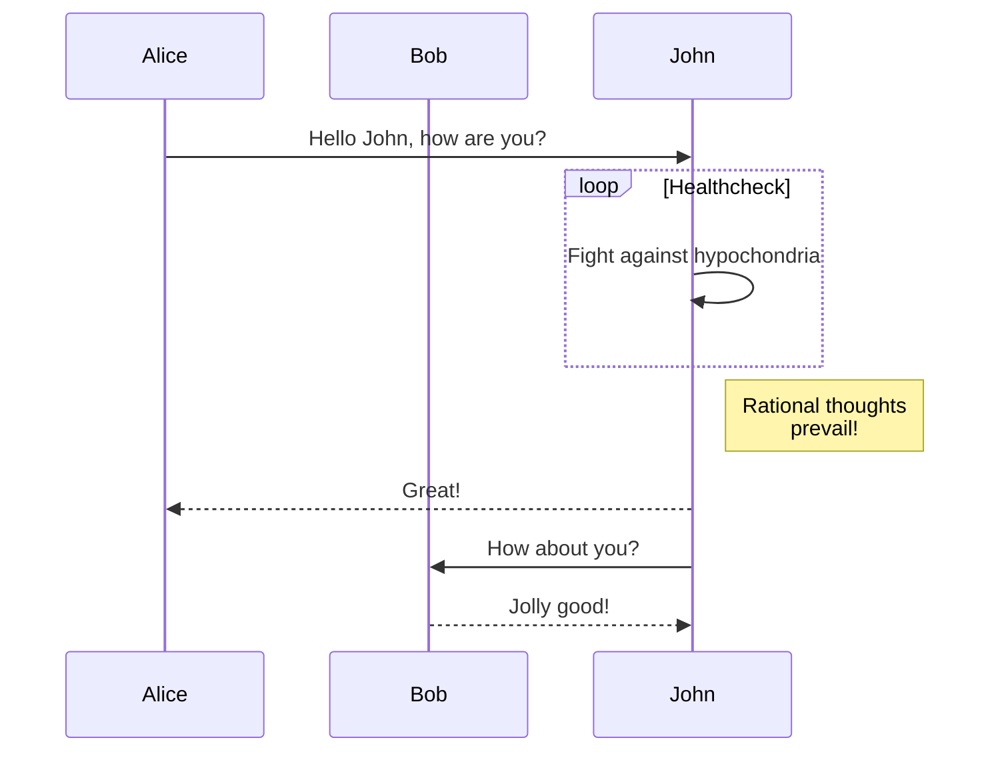

---

This is the summary of the post

<!--more-->

---

## Blockquote with attribution

> Don't communicate by sharing memory, share memory by communicating.
>
> — <cite>Rob Pike[^1]</cite>

[^1]: The above quote is excerpted from Rob Pike's [talk](https://www.youtube.com/watch?v=PAAkCSZUG1c) during Gopherfest, November 18, 2015.


## Custom Shortcode: Tabbed View



```python
print("Hello, World!")
```


```javascript
console.log("Hello, World!");
```


```go
package main

import "fmt"

func main() {
	// Array
	var a [3]int
	a[0] = 1
	a[1] = 2
	a[2] = 3
	fmt.Println("Array:", a)

	// Slice
	s := []int{10, 20, 30, 40}
	fmt.Println("Slice:", s)
	fmt.Println("Slice with append:", append(s, 50))
}
```


> Don't communicate by sharing memory, share memory by communicating.
>






Content for Tab 1



> Don't communicate by sharing memory, share memory by communicating.
>




```go
fmt.Println("Hello, World!")
```




### marimo wasm iframe

<iframe
	src="/marimo-wasm-blog/index.html?embed=true&show-chrome=false"
	width="100%"
	height="500"
	frameborder="0"
></iframe>




### Check color text 

This is a colour shortcode .
This is a colour shortcode .

## Plotly 3d plot


## plotly widget


## Mermaid



## GoAT Diagrams

```goat
      .               .                .               .--- 1          .-- 1     / 1
     / \              |                |           .---+            .-+         +
    /   \         .---+---.         .--+--.        |   '--- 2      |   '-- 2   / \ 2
   +     +        |       |        |       |    ---+            ---+          +
  / \   / \     .-+-.   .-+-.     .+.     .+.      |   .--- 3      |   .-- 3   \ / 3
 /   \ /   \    |   |   |   |    |   |   |   |     '---+            '-+         +
 1   2 3   4    1   2   3   4    1   2   3   4         '--- 4          '-- 4     \ 4

```


